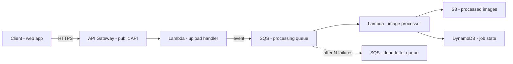
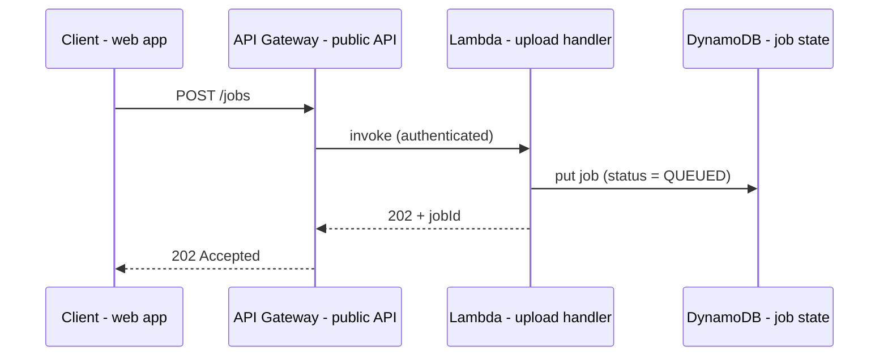

# Diagram Guidelines

Diagrams are the final projection of the architecture reasoning, not independent inventions.

## Rules
1. Mermaid is the default format. One diagram per file, saved as `.mmd`.
2. Generate each diagram only from the selected architecture text: its components, data flows and failure model. Do not add a service or link that the text does not state.
3. Every component in the architecture text appears at least once across the diagram set. Every node in a diagram exists in the text. If they disagree, the text wins.
4. Name nodes as AWS service plus role: `SQS - ingest queue`, `Lambda - image resizer`, `DynamoDB - job state`. Never a bare service name for a component with a role.
5. Label edges with what flows or how (HTTPS, event, poll, async).
6. Keep each diagram readable: aim for under about 15 nodes. Split by concern instead of cramming.
7. Show trust boundaries and public versus private areas when security matters.
8. A diagram has a short title and a one-line caption stating what it shows.

## Required diagram types
Create those that apply to the workload.

| Type | Mermaid kind | Shows |
|---|---|---|
| System context | `flowchart` | Users, external systems, the system as one box |
| AWS component architecture | `flowchart` | Services and their relationships |
| Request/data flow | `sequenceDiagram` | One request end to end |
| Async/event flow | `flowchart` or `sequenceDiagram` | Producers, queues, consumers |
| Failure/retry flow | `flowchart` | Retry, DLQ, quarantine, recovery |
| Network boundaries | `flowchart` with subgraphs | VPC, subnets, public/private, endpoints |
| Deployment topology | `flowchart` | Accounts, regions, environments |
| DR topology | `flowchart` | Primary, standby, replication, failover |

Skip types that do not apply, and say why in the report.

## Example: AWS components (flowchart)

## Example: request flow (sequenceDiagram)

## Validation before saving
- Mermaid syntax is valid; labels with special characters are quoted.
- Node names follow service plus role.
- No component, store or edge that the architecture text does not mention.
- File name states the type, for example `aws-architecture.mmd`, `data-flow.mmd`, `failure-flow.mmd`.

Later renderers (PlantUML, C4, draw.io, Graphviz, AWS icons) may consume the same architecture text. The text stays the source.
